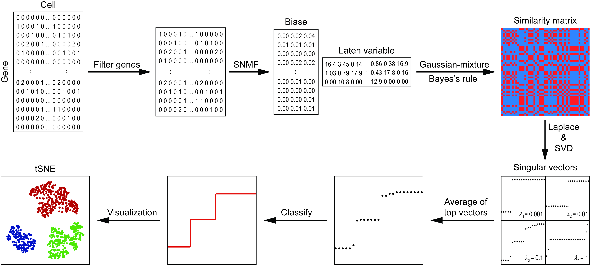
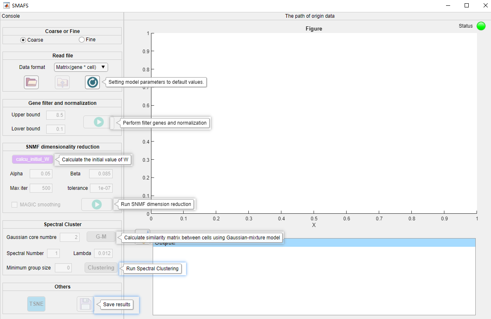

<!-- TOC -->
- [SMAFS](#smafs)
    - [Installation](#installation)
    - [GUI Tutorial](#gui-tutorial)
    - [Command-Line Tutorial](#command-line-tutorial)
    - [Help](#help)
<!-- TOC -->

SMAFS
===

SMAFS is a new algorithm for scRNA-seq data clustering based on the low-rank hypothesis of the gene expression matrix, and the combination of the sparse non-negative matrix factorization and the spectral method.

### Installation

Because SMAFS relies on the [cvx](http://cvxr.com/cvx/download/) optimization toolbox, you need to download the [cvx](http://cvxr.com/cvx/download/) toolbox and then the extraction path is set to "C: \ Software \ cvx". After downloading the project, first set the "icon" folder to the MATLAB search path. Then just double-click "SNMFS_GUI.mlapp" to start running SMAFS

### GUI Tutorial

Note: If it is the first time to cluster scRNA-seq data, it is recommended to select "Coarse". If you want to further subdivide the cell population, we recommend choosing "Fine". If using SMAFS to clustering 10x data, one should select three files matrix.mtx , barcodes.tsv and genes.tsv at the same time, and upload them to SMAFS.

### Help
If you have any questions or require assistance using SMAFS, please contact us: hyl2016@mail.ustc.edu.cn .